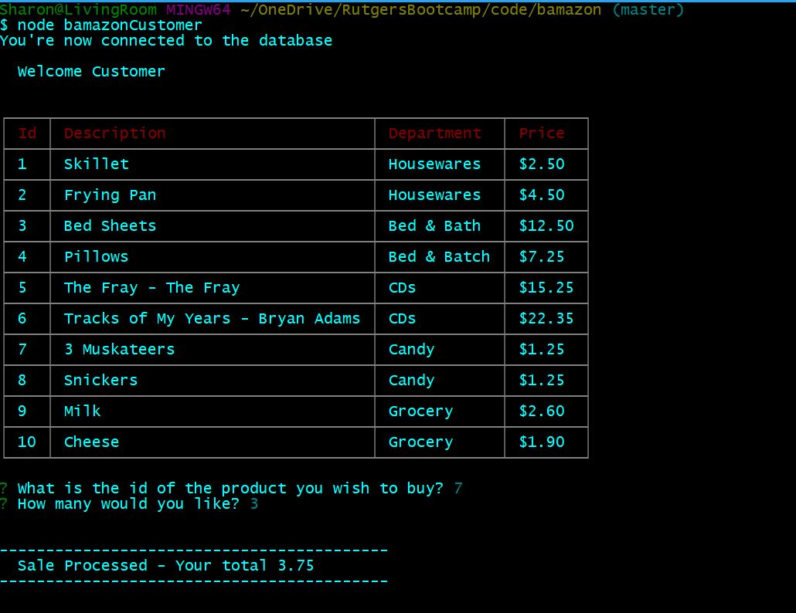
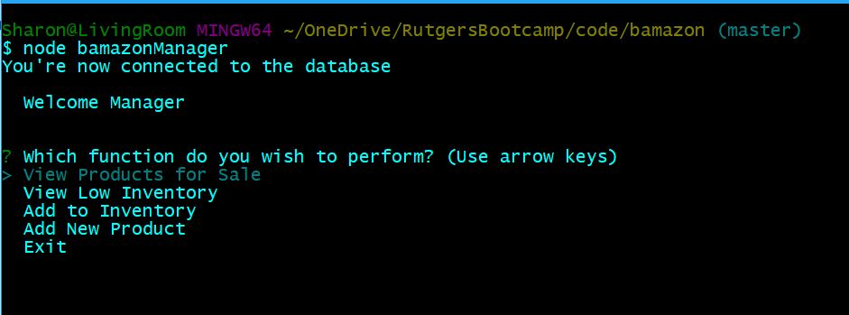
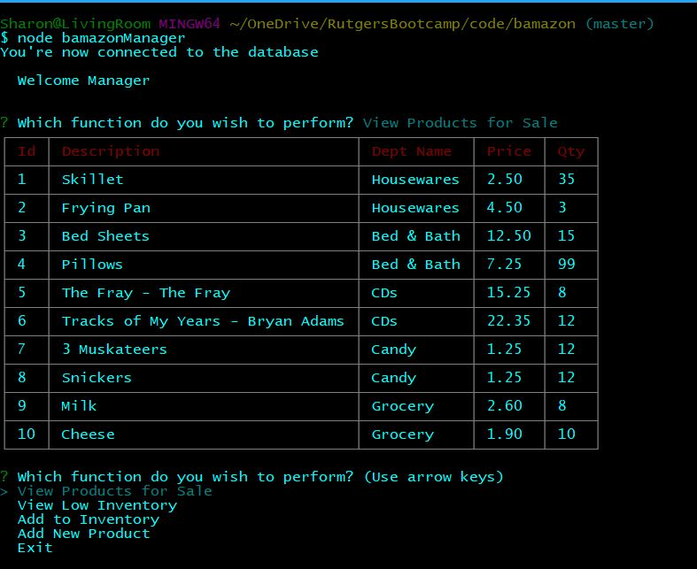
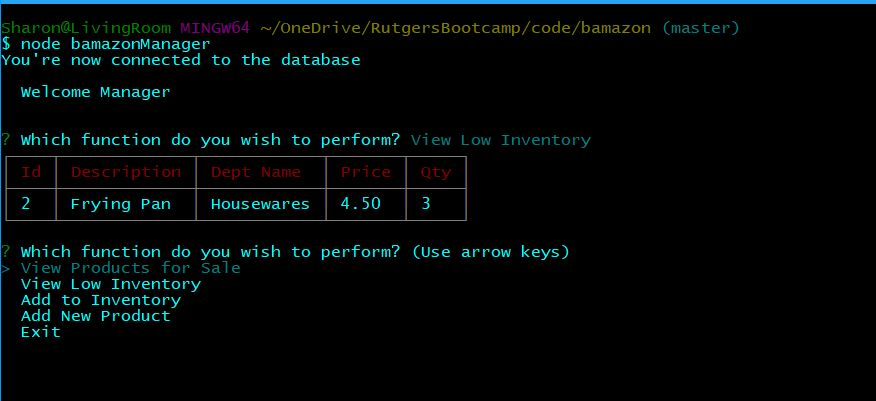
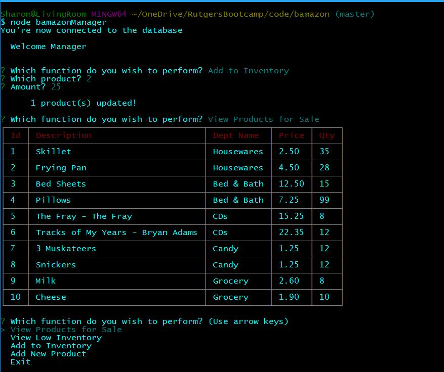
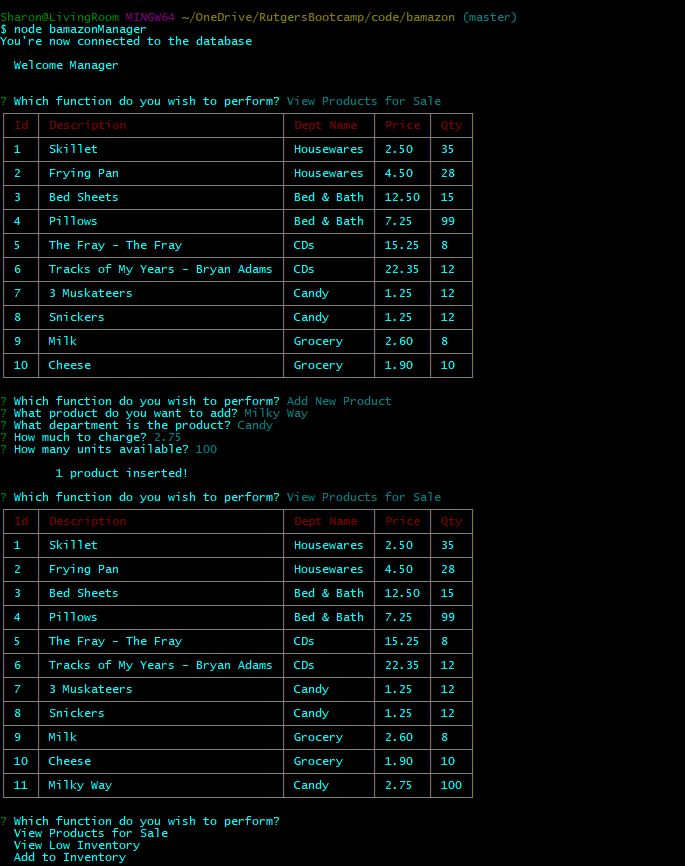
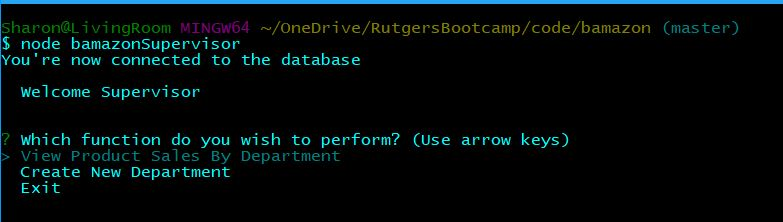
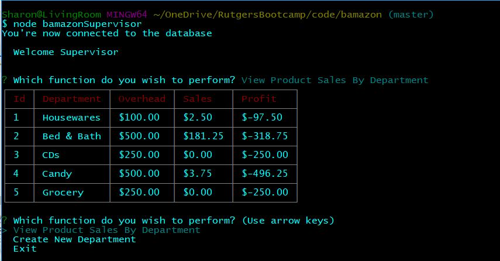
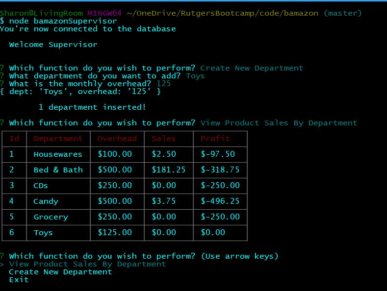

# bamazon

## Synopis

***

An interactive shopping node app where MySQL and Node.JS are used to:
1) Allow users to purchase items as a customer;
2) View, track, and update the product inventory as a manager;
3) Track total sales by departmnet, and maintain departments as the supervisor.

### Bamanzon Customer Portal

***

The Bamazon Customer Portal allows customers to view the current items available for puchase. The customer will be prompted to enter the item id# and how many items they wish to purchase. If the item is in stock, the order will be completed and the customer will see the total amount of their purchase.

### Bamazon Manager Portal

***

The Bamazon Manager Portal allows users to view and edit the inventory of the store. The manager will be prompted to choose from the following options:

* View Products for Sale
* View Low Inventory
* Add to Inventory
* Add New Product
* Exit

#### Manager Option 1

***

The first option allows the manager to see the list of products that are currently for sale, what department the item belongs to, the price of the product, and how much stock is left for that product.

#### Manager Option 2

***

The second option allows the manager to see a list of all inventory items that have less than 5 items in stock. If there are no products that meet this criteria, the manager will see an empty table.

#### Manager Option 3

***

The third option allows the manager to add inventory to an existing product.

#### Manager Option 4

***

The fourth option allows the manager to add a new product to inventory.

### Bamazon Supervisor Portal

***

The Bamazon Supervisor Portal allows users to view the total profits of the store categorized by department and add new departments. The supervisor will be prompted to choose from the following options:

### Supervisor Option 1

***

The first option allows the supervisor to view a list of departments including the overhead costs, total sales, and profits to date for the department.

### Supervisor Option 2

***

The second option allows the supervisor to add a new department.

## Installation

***

1. Clone the git repository - `git clone https://github.com/sharon-f-lewis/bamazon.git`
1. cd bamazon
1. npm install

## License

***

Copyright @2018 - Sharon F. Lewis